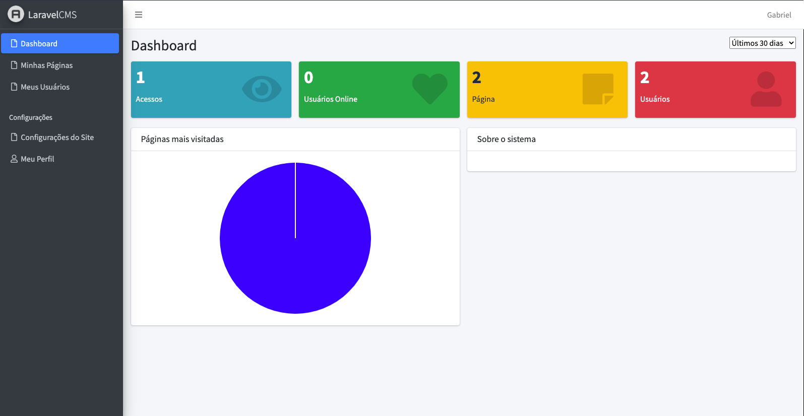

# LARAVEL CMS

  <b>Painel do Laravel CMS.</b>

  

## Conteúdo

- [CRUD EM PHP LARAVEL 8](#crud-em-php-laravel-8)
  - [Conteúdo](#conteúdo)
  - [:bookmark: Sobre](#bookmark-sobre)
  - [:rocket: Tecnologias Utilizadas](#rocket-tecnologias-utilizadas)
  - [:zap: Como usar](#zap-como-usar)
  - [:recycle: Como contribuir](#recycle-como-contribuir)

## :bookmark: Sobre

Painel administrativo em <strong>Laravel 8</strong> utilizando banco de dados MySql para gerencimanento de usuários e criação de páginas que são geradas automaticamente no front em cima de um layout template, dessa forma é possível criar uma página web apenas acessando o painel administrativo e adicionando uma nova página no CRUD com as informações. Adicionado também um paínel de estatísticas juntamente com um gráfico pizza dos acessos nas páginas.

## :rocket: Tecnologias Utilizadas

O projeto foi desenvolvido utilizando as seguintes tecnologias

- [Laravel 8](https://www.laravel.com/)
- [MySql](https://mysql.com/)
- [Bootstrap](https://getbootstrap.com/)

## :zap: Como usar
- Faça um clone desse repositório: `git clone https://github.com/Oliveiiraa/LaravelCms.git`
- Configure o .env a partir do .env-example com os dados do seu db
- Rode as depêndencias com o `composer install`
- Inicialize com `php artisan serve`
- Acesse no seu localhost:8000

## :recycle: Como contribuir

- Faça um Fork desse repositório,
- Crie uma branch com a sua feature: `git checkout -b my-feature`
- Commit suas mudanças: `git commit -m 'feat: My new feature'`
- Push a sua branch: `git push origin my-feature`

---

<h4 align=center>Made with 💙 by <a href="https://www.linkedin.com/in/gabriel-h-oliveira/">Gabriel Oliveira</a></h4>
